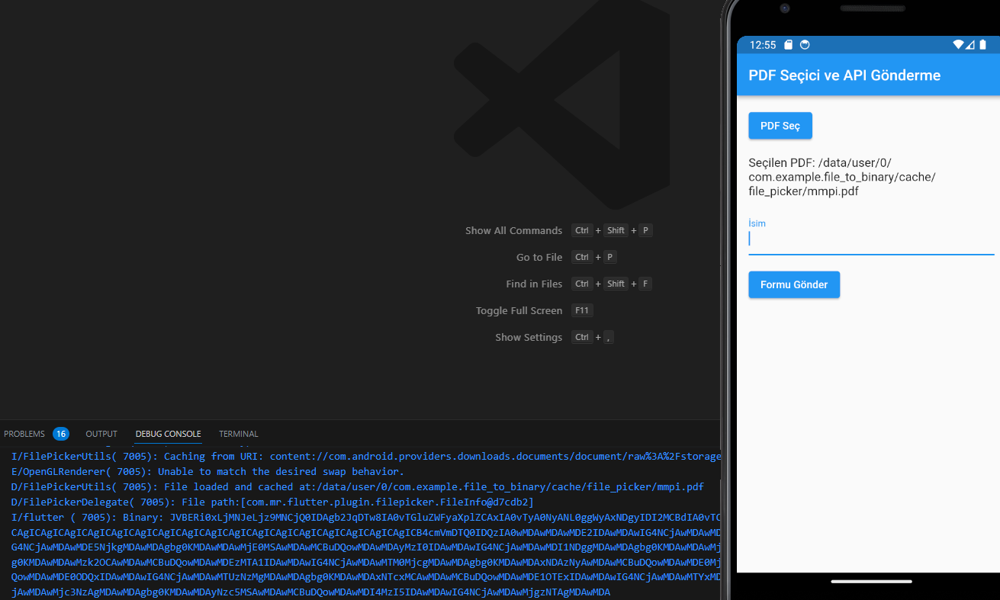

# Seçilen PDF'yi Base64 Formatında API'ye Gönderme

Bu Flutter tabanlı mobil uygulama, kullanıcının cihazından bir PDF dosyası seçmesini ve ardından bu dosyasının belirli bir API'ye Base64 formatında gönderilmesini sağlar. Uygulama ayrıca seçilen PDF dosyasının 5MB sınırını aşmamasını garanti eder.

## Başlıca Özellikler

- **Lokal Depolamadan PDF Dosya Seçimi:** Kullanıcının cihazından hızlıca PDF dosya seçimini gerçekleştirir.
- **Seçilen Dosyanın Boyut Kontrolü:** Dosyanın 5MB sınırını aşmadığını kontrol eder.
- **Base64 Dönüşümü:** Seçilen PDF'i Base64 formatına dönüştürür.
- **API Gönderimi:** Base64 formatında veriyi belirli bir API'ye gönderir.

